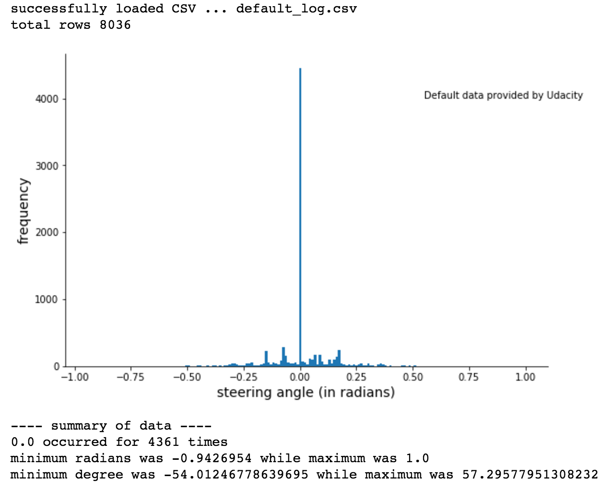
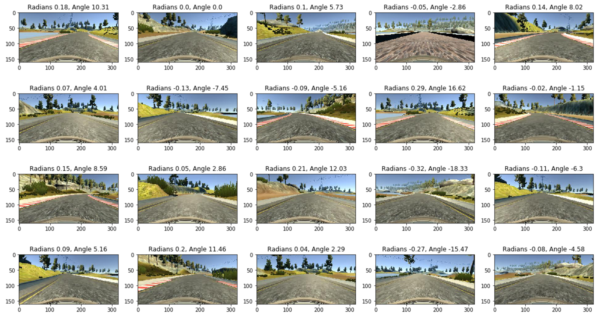
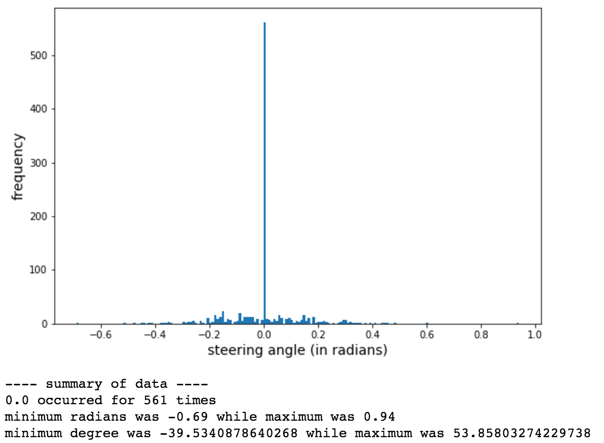
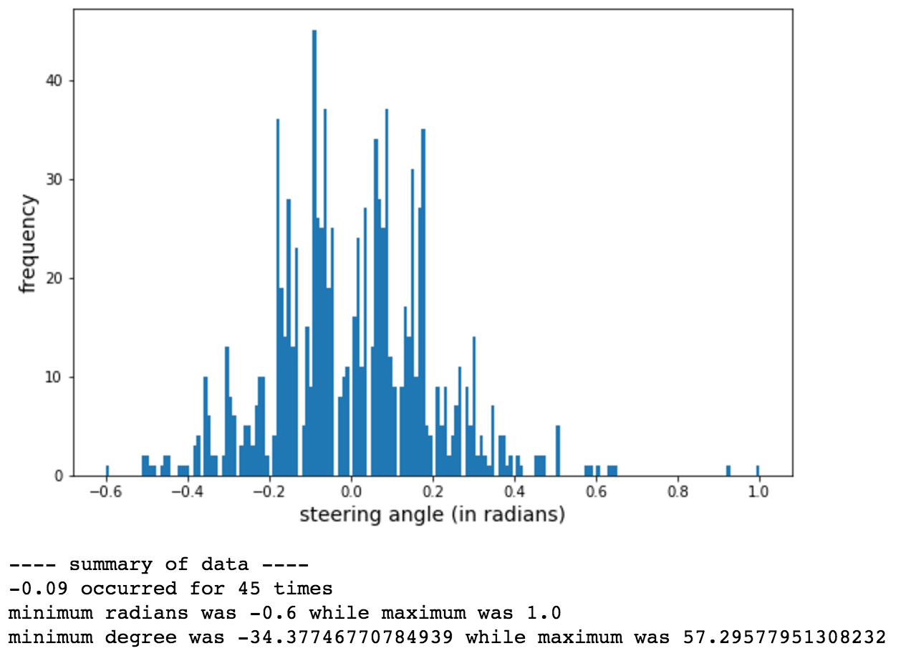
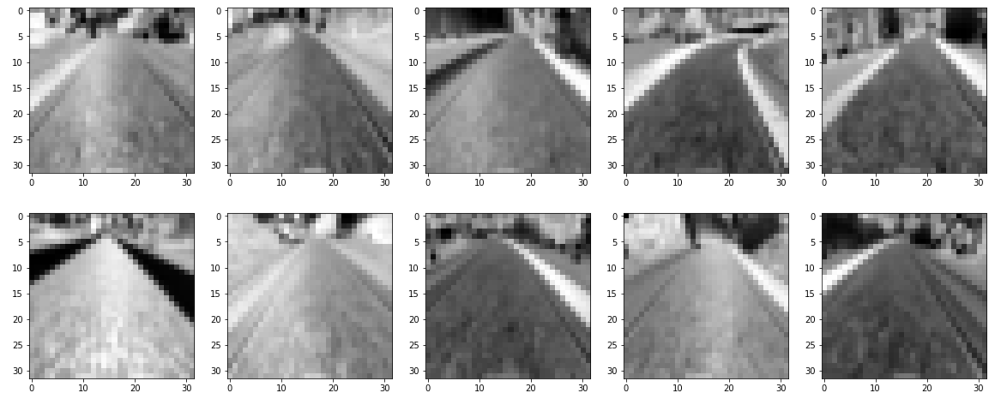

# CarND-BehaviorCloning-P3

This repository contains code to implement Behavioral Cloning and was submitted as part of Udacity's Self Driving Car Nanodegree program. For more information see - [Udacity's Self Driving Car Engineer Nanodegree](https://www.udacity.com/course/self-driving-car-engineer-nanodegree--nd013)

## Problem

To implement behavioral cloning using Udacity's car driving simulator. The simulator contains 
* a **training mode** to record images and steering angles while driving the car around two different tracks 
* and an **autonomous mode** that accepts steering angles from a trained model and drives the car based on the prediction. 

The objective is to train a neural network model based on the data collected while driving around the tracks which can predict steering angles for the car to drive around Track 1 in the autonomous mode

### Tools, Libraries and Data Input

This project is built using python and uses 

* opencv, matplotlib, numpy, keras, tensorflow, scipy and sklearn
* the car driving simulator provided by Udacity
* a data set consisting of camera images (left, center, right) and steering angles provided by Udacity

## Approach and Implementation

### Data

A solution to such a problem relies heavily on the data generation strategy used. 

#### Default Provided

A simple visualisation of the default dataset provided by Udacity revealed that 54% of the data contained the 0.00 steering angle. An obvious risk of using such a dataset to train a neural network is that the model will be heavily trained on 0.00 angle data and will not be able to reliably predict other angles.

Here is the histogram of the default dataset - 



and here are some of the images from this dataset -
 
 
 
#### Data Generation Strategy

The strategy used was to use a data generator that could generate images and steering angles from the data provided by augmenting the data using image shifts and flips. The generator also ensured the ratio of similar angles being generated is never more than 20% of the overall data. The angles [0.00, 0.01, 0.02, 0.03, 0.04, 0.06, 0.07, 0.08, 0.09] was assumed to be similar to 0.05.

##### Camera Images

The camera images were chosen on a random basis from the left, center or right camera

```
cam_choice = np.random.randint(0, 3)
if cam_choice == 0:
    x_data, y_data = get_left_cam_image(_x, _y)
elif cam_choice == 1:
    x_data, y_data = get_center_cam_image(_x, _y)
else:
    x_data, y_data = get_right_cam_image(_x, _y)
```

##### Image Shifts

The selected image was shifted to the left or right based on a random choice using opencv and the corresponding angle offset modified to the original steering angle dataset

```
rows, cols, ch = x_data.shape
trans_wid = np.random.randint(0, 25)
trans_matrix = np.float32([[1, 0, -trans_wid], [0, 1, 0]])
translated_image = cv2.warpAffine(x_data, trans_matrix, (cols, rows))
```

##### Image Flips

The augmented image was flipped vertically based on a random choice and the steering angle's sign modified

```
x_data = np.fliplr(x_data)

# if angle is 0.00 do no switch the signs
if "%.2f" % y_data != "0.00":
    y_data = y_data * -1

return x_data, y_data
```

##### Angle Ratio

The generated image was discarded if count of similar images already generated reached the threshold value. The threshold value was reduced for each epochs. This ensured the data included all possible angles and not just 0.00.


```
# sum the count of all angles generated in the similar list
for check_angle in tr_list:
    if check_angle in generated_angles:
        total_angle_count = total_angle_count + generated_angles[check_angle]
    else:
        generated_angles[check_angle] = 0
        
# if sum is greater than threshold value discard the angle and continue
if total_angle_count <= batch * fraction:
    if angle_key == "-0.00":
        angle_key = "0.00"
    generated_angles[angle_key] = generated_angles[angle_key] + 1
else:
    continue
```

Here is a summary of images generated during the initial epoch - 



and this is a summary of the images generated during the final epoch - 




##### Additional Data

More data was added to the dataset using the following techniques -
* General training data by driving around the track slowly for around two laps
* Recovery data by moving the car to the edge of the track and then recording the movement of the car back to the center of the lane

The data was generated using the 10 FPS version of the simulator (default) at "Simple" quality and lowest resolution (existing hardware limitation)

#### Data Pre-processing

The original image (320 x 160) contained the landscape on the top and the hood of the car in the bottom. Hence, the top 50 pixels and the bottom 20 pixels were removed. These images were then resized to a 32x32 image by the nearest interpolation strategy using scipy. The pixels were then normalized between -0.5 to 0.5 in order to make the calculations easier.

```
x_resized = x[IMAGE_TOP_ROI:IMAGE_BOTTOM_ROI:, :, ]
x_resized = misc.imresize(x_resized, size=(IMG_HEIGHT, IMG_WIDTH, IMG_CHANNELS))

# normalize the image so the calculations are smaller
a = -0.5
b = 0.5
min = 0
max = 255
x_normalized = a + (((x_resized - min) * (b - a)) / (max - min))
```

The dimension of the processed image was 32x32x3 and the values were normalized between -0.5 to 0.5

Preprocessed images look like this - 


 
### The Network Model

#### First Attempt

In the first attempt a VGG16 like model was built using the trained weights available [here](https://gist.github.com/baraldilorenzo/07d7802847aaad0a35d3). The last fully connected layers of the VGG16 model were removed and instead 5 new fully connected layers were added with output dimensions decreasing gradually from 1024 to 1. The first 5 block layers were marked as non-trainable. The model had around 15,00,000+ parameters available to train. The problem was the hardware available (Macbook Pro 2015 8GB variant) and this model needed huge memory allocation to train. I discarded this model simply because it was too much for my hardware.
   
#### Final Model

A simple model consisting of 4 convolution layers and 5 fully connected layers was constructed for the final solution. The network had a total of 4,29,629 parameters available to train. Here is a summary of the model used - 

```
____________________________________________________________________________________________________
Layer (type)                     Output Shape          Param #     Connected to                     
====================================================================================================
input_conv1 (Convolution2D)      (None, 32, 32, 3)     12          convolution2d_input_1[0][0]      
____________________________________________________________________________________________________
block1_conv1 (Convolution2D)     (None, 32, 32, 64)    1792        input_conv1[0][0]                
____________________________________________________________________________________________________
block1_pool (MaxPooling2D)       (None, 16, 16, 64)    0           block1_conv1[0][0]               
____________________________________________________________________________________________________
block2_conv1 (Convolution2D)     (None, 16, 16, 32)    18464       block1_pool[0][0]                
____________________________________________________________________________________________________
block2_pool (MaxPooling2D)       (None, 8, 8, 32)      0           block2_conv1[0][0]               
____________________________________________________________________________________________________
block3_conv1 (Convolution2D)     (None, 8, 8, 16)      4624        block2_pool[0][0]                
____________________________________________________________________________________________________
block3_pool (MaxPooling2D)       (None, 4, 4, 16)      0           block3_conv1[0][0]               
____________________________________________________________________________________________________
flat (Flatten)                   (None, 256)           0           block3_pool[0][0]                
____________________________________________________________________________________________________
fc1 (Dense)                      (None, 1024)          263168      flat[0][0]                       
____________________________________________________________________________________________________
elu_1 (ELU)                      (None, 1024)          0           fc1[0][0]                        
____________________________________________________________________________________________________
fc1_dropout (Dropout)            (None, 1024)          0           elu_1[0][0]                      
____________________________________________________________________________________________________
fc2 (Dense)                      (None, 128)           131200      fc1_dropout[0][0]                
____________________________________________________________________________________________________
elu_2 (ELU)                      (None, 128)           0           fc2[0][0]                        
____________________________________________________________________________________________________
fc2_dropout (Dropout)            (None, 128)           0           elu_2[0][0]                      
____________________________________________________________________________________________________
fc3 (Dense)                      (None, 64)            8256        fc2_dropout[0][0]                
____________________________________________________________________________________________________
elu_3 (ELU)                      (None, 64)            0           fc3[0][0]                        
____________________________________________________________________________________________________
fc3_dropout (Dropout)            (None, 64)            0           elu_3[0][0]                      
____________________________________________________________________________________________________
fc4 (Dense)                      (None, 32)            2080        fc3_dropout[0][0]                
____________________________________________________________________________________________________
elu_4 (ELU)                      (None, 32)            0           fc4[0][0]                        
____________________________________________________________________________________________________
fc4_dropout (Dropout)            (None, 32)            0           elu_4[0][0]                      
____________________________________________________________________________________________________
output (Dense)                   (None, 1)             33          fc4_dropout[0][0]                
====================================================================================================
Total params: 429,629
Trainable params: 429,629
Non-trainable params: 0
____________________________________________________________________________________________________

```
The network was trained using the Adam optimizer and the weights were modified to reduce the mean squared error. The batch size was 128 and the network was trained for around 25 epochs until the mean squared error was less then 4%. The final layer had an output dimension of 1 and this was mapped to the steering angle (in radians).


##### Data Regularization

In order to prevent over-fitting of the training data, 33% of available data was split into the validation dataset. Also all the fully connected layers had a 50% dropout layer after activation. Moreover data augmentation was heavily used which guaranteed new data for every batch.

### Result

The car was able to drive on its own in Track 1. The simulator was again started in the lowest resolution (640x480) and the graphics quality was "Simple". The car was able to make multiple laps in the track without intervention. 

#### Observation - Track 1
* The car was able to stay on the road for multiple laps on Track 1
* It was observed that the car swerved in the straights sometimes. This could be because of lesser amount of data available for 0.00 angles (due to thresholding)
* The car moved to the edge of the road during FPS drops (if another resource heavy application was opened during simulation).
 
#### Observation - Track 2
* The car was not able to perform well in Track 2. Please note that the model never had training data from Track 2.

The failure in Track 2 could be because
* the model was not trained for dark images. Track 2 consisted of a lot of shadows and a different texture of the road (tarmac compared to muddy on Track 1)

### Future Considerations

* Implement image brightness augmentation so the car can drive around Track 2 as well
* Implement image translation on the y-axis to simulate a bumpy environment
* Implement a more sophisticated model like the Nvidia Pipeline described [here](https://devblogs.nvidia.com/parallelforall/deep-learning-self-driving-cars/)
* Use the 50 Hz simulator for more smoother steering angles


